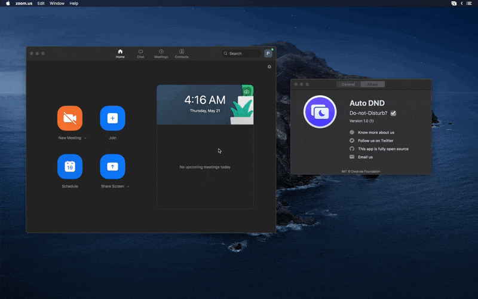

<p align="center">
	
</p>
<p align="center">
<a href="https://github.com/dwarvesf/auto-dnd/releases/latest">
 		
	<a href="https://img.shields.io/badge/platform-macOS-lightgrey.svg">
 		
	</a>
	<a href="https://img.shields.io/badge/requirements-macOS Sierra+-ff69b4.svg">
 		
	</a>
</p>

## Auto DND

Meet Auto DND - a mac app that keeps notifications stays right where it should.

In other words, once you're conducting a screen sharing during video meeting, DnD automatically enables the do-not-disturb mode, which avoids the chance of notification to be shown on your desktop screen. Other attendees, such at your boss, co-workers or student, won't have to know your billing issue problem, your date at 7pm that night or your next road trip to Machu Picchu.

<p align="center">
	
</p>

## 🚀 Install

The Auto DND is notarized before distributed. It's safe to use 👍

#### Using HomeBrew

```Shell
$ brew tap dwarvesf/homebrew-tap
$ brew cask install autodnd
```

#### Manual download

- [Download latest version](https://github.com/dwarvesf/auto-dnd/releases/latest)
- Unzip and drag the app to the Applications folder
- Right click and press open in context menu to open app

## 🕹 Usage

- Open the app
- Install the helper tool
- This app will auto turn on DND mode whenever there is a meeting
- Support video meeting apps with screen sharing such as Zoom, Google Hangout, Slack, Skype,..

## ✨<a href="https://github.com/dwarvesf/auto-dnd/graphs/contributors">Contributors</a>

This project exists thanks to all the people who contribute. Thank you guys so much 👏

[](https://sourcerer.io/fame/phucledien/dwarvesf/auto-dnd/links/0)[](https://sourcerer.io/fame/phucledien/dwarvesf/auto-dnd/links/1)[](https://sourcerer.io/fame/phucledien/dwarvesf/auto-dnd/links/2)[](https://sourcerer.io/fame/phucledien/dwarvesf/auto-dnd/links/3)[](https://sourcerer.io/fame/phucledien/dwarvesf/auto-dnd/links/4)[](https://sourcerer.io/fame/phucledien/dwarvesf/auto-dnd/links/5)[](https://sourcerer.io/fame/phucledien/dwarvesf/auto-dnd/links/6)[](https://sourcerer.io/fame/phucledien/dwarvesf/auto-dnd/links/7)

Please read [this](CONTRIBUTING.md) before you make a contribution.

## Requirements
macOS version >= 10.12

## You may also like
- [Hidden Bar](https://github.com/dwarvesf/hidden) - An ultra-light MacOS utility that helps hide menu bar icons
- [Blurred](https://github.com/dwarvesf/blurred) - A macOS utility that helps reduce distraction by dimming your inactive noise
- [Micro Sniff](https://github.com/dwarvesf/micro-sniff) - An ultra-light macOS utility that notify whenever your micro-device is being used
- [VimMotion](https://github.com/dwarvesf/VimMotionApp) - Access macOS UI elements with your fingers stay on keyboard. Inspired by vim-easymotion & avy-mode.

## License

MIT &copy; [Dwarves Foundation](https://github.com/dwarvesf)
